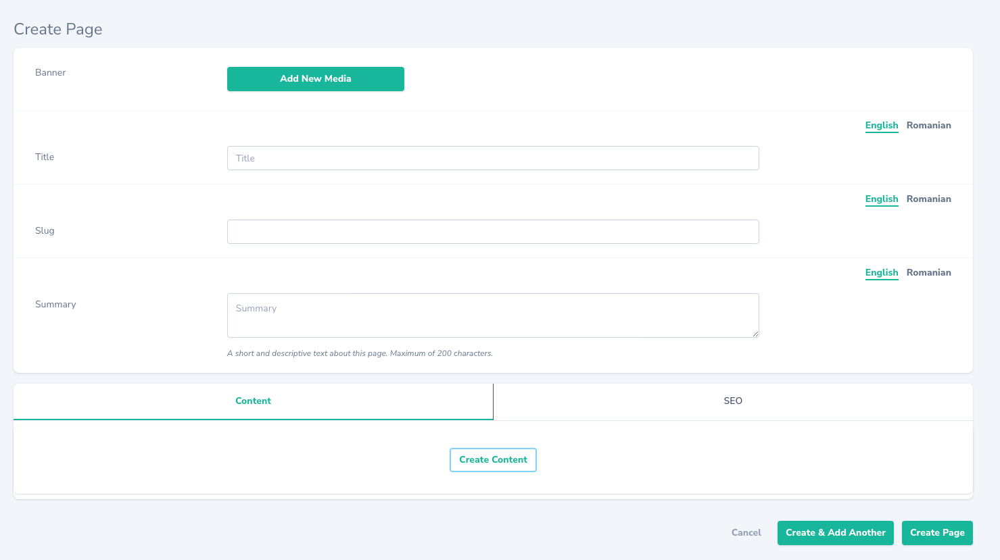
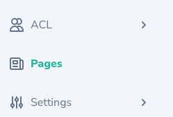

# Page Manager Module

Manages static pages.




## Installation

Dependencies
* [morphling-module](https://github.com/morphcms/morphling-module)
* [acl-module](https://github.com/morphcms/acl-module)
* [seo-sorcery-module](https://github.com/morphcms/seo-sorcery-module)
* [page-builder-module](https://github.com/morphcms/page-builder-module)

Install module

```shell
php artisan module:install morphcms/page-manager-module
```

Migrate

```shell
php artisan migrate
```

Seed Permissions and Sample Data

```shell
php artisan module:seed PageManager
```

## Usage

Now you should be able to view the module in the navbar.



WIP
